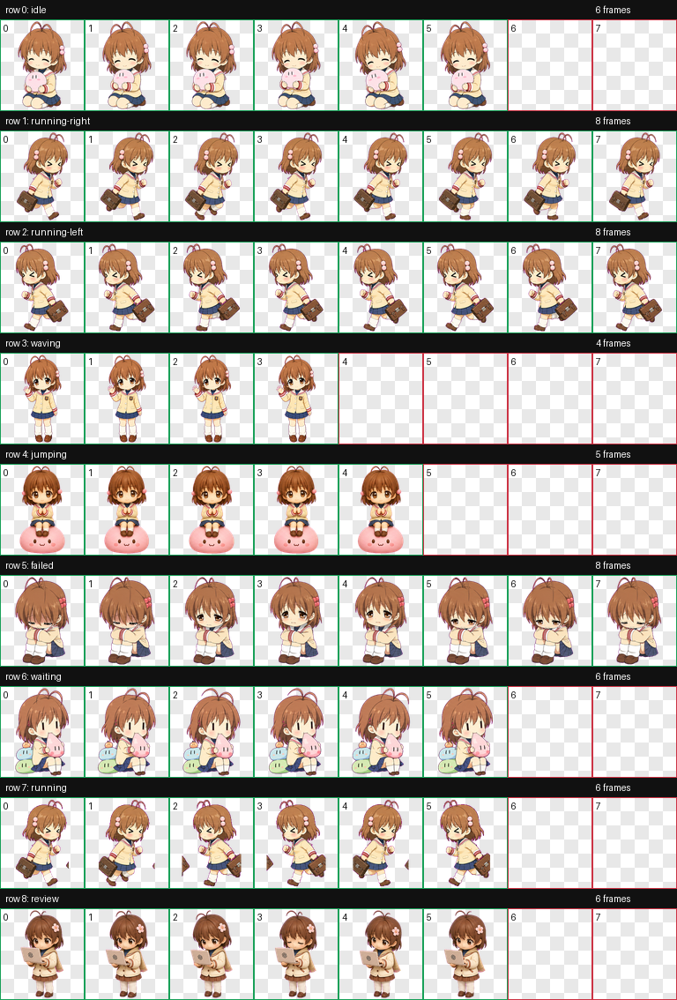

# 古河渚 Codex 宠物

这个仓库保存了一套可直接使用的 Codex 自定义宠物资源，角色为《CLANNAD》中的古河渚。



## 角色信息

- 名称：古河渚
- 标识：`nagisa-furukawa`
- 风格：Q 版校园系
- 特征：短棕发、团子发饰、米白校服、温柔害羞气质

## 仓库内容

`nagisa-furukawa/` 目录包含以下文件：

- `pet.json`：宠物元信息
- `spritesheet.webp`：宠物动画图集
- `contact-sheet.png`：动作总览图

## 使用方法

如果你想在 Codex 中使用这只宠物，可以把 `nagisa-furukawa` 整个目录放到自己的宠物目录中。

```text
<Codex pets 目录>/
```

目标结构如下：

```text
<Codex pets 目录>/
  nagisa-furukawa/
    pet.json
    spritesheet.webp
```

其中：

- `pet.json` 是必需文件
- `spritesheet.webp` 是运行时使用的主图集
- `contact-sheet.png` 主要用于预览和人工检查

## 说明

当前仓库保存的是已经完成的宠物成品，适合直接归档、分享，或作为公开示例仓库继续补充说明。

## 开发说明

为了减少个人环境信息暴露，仓库文档只保留通用目录示意，不记录个人设备路径、本地工作树位置或临时目录信息。
